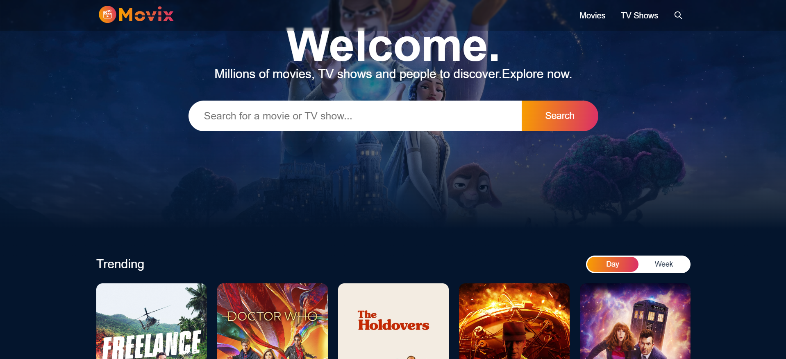

# Movie Explorer

Movie Explorer is a web application that allows users to explore newly released films as well as older movies. It fetches movie data from The Movie Database (TMDB) API and includes features such as sorting, searching, infinite scrolling, and a user-friendly interface.

# Image

## 🚨 Important Notice
**Currently, the TMDB API is down, so the site is not fully functional.** As a result, movie data cannot be retrieved at the moment. Please check back later when the TMDB service is restored.

## Features
- Fetches newly released and previously released movies from TMDB API.
- **Sorting**: Sort movies by release date, rating, or popularity.
- **Searching**: Search for movies by title.
- **Infinite Scroll**: Scroll continuously to load more movies.
- **User-Friendly UI**: The application is designed for an intuitive and smooth user experience.
- Built with **SCSS** for styling, offering better maintainability and flexibility over regular CSS.

## Tech Stack
- **Frontend**: ReactJs, Redux store and SCSS
- **API**: [TMDB API](https://www.themoviedb.org/)
  
## Installation and Setup
1. Clone the repository:
    \`\`\`bash
    git clone https://github.com/yourusername/your-repo-name.git
    cd your-repo-name
    \`\`\`

2. Install dependencies:
    \`\`\`bash
    npm install
    \`\`\`

3. Create a \`.env\` file in the root of your project and add your TMDB API key:
    \`\`\`
    REACT_APP_TMDB_API_KEY=your_tmdb_api_key
    \`\`\`

4. Start the development server:
    \`\`\`bash
    npm start
    \`\`\`

5. Open the application in your browser:
    \`\`\`
    http://localhost:3000
    \`\`\`

## Usage
Once the application is running, you can:
- View newly released movies.
- Sort or search movies using the available options.
- Scroll through an infinite list of movies.

## Known Issues
- **TMDB API Downtime**: As of now, the TMDB API is not responding. This may cause the site to fail in fetching movie data. Please be patient as we wait for the API service to be restored.

## License
This project is licensed under the MIT License.
